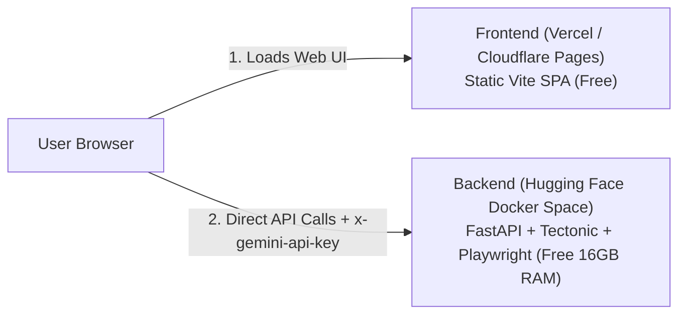

# Deployment Guide: Resume-Interview-Assistant

This guide outlines the exact, step-by-step process for deploying the **Resume-Interview-Assistant** 100% free with a "deploy once and forget" setup using:
- **Backend**: Hugging Face Spaces (Docker Space — 2 vCPUs, 16 GB RAM free)
- **Frontend**: Vercel or Cloudflare Pages (Free Global CDN)

---

## 1. Prerequisites & Architecture



- **Frontend**: Static React + Vite app (`frontend/`)
- **Backend**: FastAPI with Tectonic (LaTeX engine) and Playwright (Chromium scraper) (`backend/`)

---

## 2. Backend Deployment (Hugging Face Spaces)

### Step 2.1: Hugging Face Spaces-Ready Dockerfile

Hugging Face Spaces runs containers as an unprivileged user (`user` with `UID: 1000`) and expects traffic on port **`7860`**.

Use the following optimized Dockerfile configuration (save as `backend/Dockerfile` or as `Dockerfile` in your HF Space repository):

```dockerfile
FROM python:3.13-slim

ENV DEBIAN_FRONTEND=noninteractive \
    PYTHONUNBUFFERED=1 \
    PORT=7860 \
    HOME=/home/user \
    PATH=/home/user/.local/bin:$PATH \
    PLAYWRIGHT_BROWSERS_PATH=/home/user/.cache/ms-playwright

# 1. Install system dependencies & Tectonic LaTeX engine
RUN apt-get update && apt-get install -y \
    curl \
    ca-certificates \
    tar \
    unzip \
    libnss3 \
    libnspr4 \
    libatk1.0-0 \
    libatk-bridge2.0-0 \
    libcups2 \
    libdrm2 \
    libdbus-1-3 \
    libxcb1 \
    libxkbcommon0 \
    libx11-6 \
    libxcomposite1 \
    libxdamage1 \
    libxext6 \
    libxfixes3 \
    libxrandr2 \
    libgbm1 \
    libasound2 \
    libpangocairo-1.0-0 \
    libpango-1.0-0 \
    libcairo2 \
    && curl --proto '=https' --tlsv1.2 -fsSL https://drop-sh.fullyjustified.net | sh \
    && mv tectonic /usr/local/bin/ \
    && rm -rf /var/lib/apt/lists/*

# 2. Create non-root user (UID 1000 required by Hugging Face)
RUN useradd -m -u 1000 user && \
    mkdir -p /home/user/.cache/Tectonic /home/user/.cache/ms-playwright /app && \
    chown -R user:user /home/user /app

WORKDIR /app

# 3. Copy backend code and dependencies
COPY --chown=user:user . backend/

# 4. Switch to non-root user
USER user

# 5. Install Python dependencies and Playwright Chromium
RUN pip install --no-cache-dir pip-tools && \
    pip-compile --resolver=backtracking backend/requirements.in --output-file backend/requirements.txt && \
    pip install --no-cache-dir --user -r backend/requirements.txt && \
    playwright install chromium

ENV PYTHONPATH=/app

EXPOSE 7860

CMD ["uvicorn", "backend.main:app", "--host", "0.0.0.0", "--port", "7860"]
```

---

### Step 2.2: Create the Space on Hugging Face

1. Go to [huggingface.co/new-space](https://huggingface.co/new-space).
2. Configure your Space:
   - **Space Name**: `resume-rebuilder-api` (or your choice).
   - **License**: MIT / Apache 2.0.
   - **Space SDK**: Select **Docker** -> **Blank**.
   - **Space Hardware**: Free tier (2 vCPUs, 16 GB RAM).
   - **Visibility**: Public (or Private).
3. Create a `README.md` in the root of the Space repo with this YAML frontmatter:
   ```yaml
   ---
   title: Resume Rebuilder Backend
   emoji: 📄
   colorFrom: blue
   colorTo: indigo
   sdk: docker
   app_port: 7860
   ---
   ```
4. Push your backend code and `Dockerfile` to the Space repository.
5. Once built, note your direct API endpoint URL:
   - Direct API format: `https://<YOUR-USERNAME>-<YOUR-SPACE-NAME>.hf.space`
   - *(Do NOT use `https://huggingface.co/spaces/...` for API requests; use the `.hf.space` domain!)*

---

## 3. Frontend Deployment (Vercel)

### Step 3.1: Connect Repository to Vercel

1. Log in to [vercel.com](https://vercel.com) and click **"Add New..." > "Project"**.
2. Select your GitHub repository.
3. Configure the project settings:
   - **Framework Preset**: `Vite`
   - **Root Directory**: Click "Edit" and choose `frontend`.
   - **Build Command**: `npm run build`
   - **Output Directory**: `dist`
   - **Install Command**: `npm install`

### Step 3.2: Configure Environment Variables

Under **Environment Variables**, add:

| Key | Value | Description |
| :--- | :--- | :--- |
| `VITE_API_BASE_URL` | `https://<YOUR-USERNAME>-<YOUR-SPACE-NAME>.hf.space` | Direct Hugging Face backend endpoint |

4. Click **Deploy**.

---

## 4. Safeguards & "Set-and-Forget" Checklist

### A. Preventing Cold Start Delays (Optional Keep-Alive)
- Free Hugging Face Spaces sleep after prolonged inactivity.
- **Solution**: Set up a free ping monitor (e.g. [cron-job.org](https://cron-job.org) or [UptimeRobot](https://uptimerobot.com)) to send a GET request to `https://<YOUR-USERNAME>-<YOUR-SPACE-NAME>.hf.space/docs` every 15–30 minutes to keep the container awake.

### B. User ID 1000 & Cache Permissions
- Ensure directories `/home/user/.cache/Tectonic` and `/home/user/.cache/ms-playwright` are created and owned by user `1000`.
- This ensures Tectonic package downloads and Playwright browser instances will not fail due to `Permission Denied` errors.

### C. CORS Protection
- `backend/main.py` is already configured with `CORSMiddleware`.
- If you wish to restrict API access strictly to your frontend domain, update `allow_origins` in `backend/main.py`:
  ```python
  app.add_middleware(
      CORSMiddleware,
      allow_origins=[
          "http://localhost:5173",
          "https://your-frontend-app.vercel.app",
      ],
      allow_credentials=False,
      allow_methods=["*"],
      allow_headers=["*"],
  )
  ```

### D. Zero Data Retention & BYOK Security
- The backend accepts `x-gemini-api-key` in HTTP headers and does not store keys or resume data in persistent databases.
- All temporary compilation files (`.tex`, `.pdf`, `.aux`) generated during LaTeX compilation are cleaned up immediately after processing.

---

## 5. Verification Checklist

After deployment, verify the following endpoints:

- [ ] **Health Check**: Visit `https://<YOUR-SPACE>.hf.space/docs` and ensure Swagger UI loads.
- [ ] **LaTeX Compilation**: Test compiling a standard LaTeX snippet via frontend.
- [ ] **Job URL Scraper**: Test scraping a sample job posting URL via frontend.
- [ ] **BYOK AI Processing**: Test analyzing/rebuilding a resume using a valid Gemini API key.
