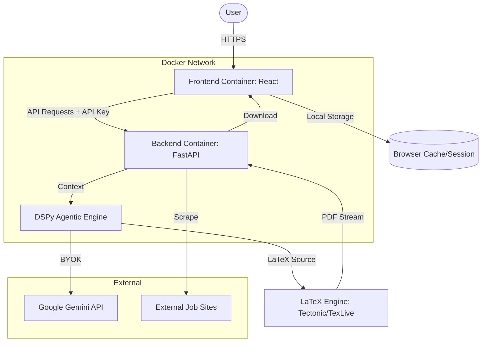
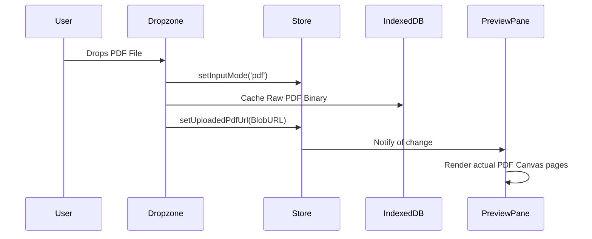

# System Design Plan: Enterprise Resume Rebuilder (Dockerized React + DSPy)

This document outlines the architectural transformation from a Streamlit prototype to a secure, dockerized, full-stack application focused on privacy and professional UX.

## 1. High-Level Architecture (Dockerized)

The system is split into independent services orchestrated via Docker Compose, utilizing a "Bring Your Own Key" (BYOK) approach for LLM access.



## 2. Component Specifications

### A. Frontend: React (Vite + Tailwind CSS)
- **Role**: Rich, interactive UI with a live LaTeX editor and PDF preview.
- **Persistence**: Uses **Zustand** with `persist` middleware (LocalStorage/SessionStorage) to ensure the resume and analysis aren't lost on page refresh.
- **Security**: The user's API key is stored only in the browser's memory or encrypted LocalStorage; it is never persisted on the server.

### B. Backend: FastAPI (Python)
- **Role**: High-performance asynchronous API gateway between the React UI and the DSPy agents.
- **Engine**: Houses the `ResumeOrchestrator` which sequences the Scraping, Analysis, and Rebuilding phases.
- **Privacy**: Implements a "Zero-Retention" policy. Resume data is processed in-memory and never written to a server-side database.

### C. Agentic Layer (DSPy)
- **Analyzer Agent**: Critiques LaTeX source against Job Descriptions. Optimized with `BootstrapFewShot`.
- **Rebuilder Agent**: Generates surgical LaTeX patches.
- **BYOK Config**: DSPy is dynamically re-initialized per request using the `GOOGLE_API_KEY` provided in the request headers.

## 3. Security & Privacy Framework

| Feature | Implementation |
| :--- | :--- |
| **BYOK** | Users provide their own Gemini API key in the UI. The backend uses this key for that specific session only. |
| **Data Privacy** | No server-side database. All resume processing is transient (In-Memory). |
| **Encryption** | TLS/SSL for all transit. Local storage encryption for sensitive session data. |
| **Isolation** | Docker containers ensure that the LaTeX compiler and Backend logic are isolated from the host system. |

## 4. Technical Stack

| Tier | Technology |
| :--- | :--- |
| **Frontend** | React (TypeScript), Vite, Tailwind CSS, Monaco Editor (for LaTeX) |
| **Backend** | FastAPI, Uvicorn, Pydantic |
| **Agents** | DSPy (Optimized for Gemini 2.0 Flash) |
| **Containerization** | Docker, Docker Compose |
| **LaTeX Engine** | Tectonic (Rust-based, lightweight) or TexLive |
| **Scraping** | Playwright (Headless) |

## 5. Data Flow (End-to-End)

1.  **Session Start**: User enters their Google API Key in the React frontend.
2.  **Upload & Scrape**: User uploads a `.tex` file and provides a Job URL.
3.  **Secure Processing**:
    - Frontend sends the LaTeX + URL + API Key to the Backend.
    - Backend triggers the **Scraper Agent** to get job context.
    - **Analyzer** and **Rebuilder** agents process the resume using the user's key.
4.  **Live Edit Loop**:
    - The `Rebuilder` returns suggested LaTeX edits.
    - React displays these in a side-by-side **Monaco Editor**.
    - Changes are saved to **LocalStorage** automatically to prevent loss on refresh.
5.  **Compilation**: Backend compiles the final LaTeX to PDF via a Dockerized LaTeX engine and returns the byte stream for instant preview.

## 6. Directory Structure

```text
Resume-Interview-Assistant/
├── frontend/ (React App)
│   ├── src/components/ (Editor, Preview, Dashboard)
│   ├── src/store/ (Zustand state management)
│   └── Dockerfile
├── backend/ (FastAPI App)
│   ├── agents/ (DSPy Signatures & Modules)
│   ├── services/ (Scraping, LaTeX Compilation)
│   ├── main.py (API Routes)
│   └── Dockerfile
├── docker-compose.yml
└── PLAN.md
```

## 7. Roadmap

1.  **Docker Setup**: Initialize the multi-container environment.
2.  **BYOK Integration**: Implement secure header handling for API keys in FastAPI.
3.  **State Persistence**: Set up Zustand stores in React for resume and analysis data.
4.  **LaTeX Editor**: Integrate the Monaco editor with LaTeX syntax highlighting and sync it with the backend compiler.

---

## 8. Phase 2: Retro XP Theme System & High-Fidelity PDF Preview

This phase refines the aesthetic styling and PDF visualization to build a polished retro experience and cohesive preview pane.

### 🎨 Windows XP Theming Strategy

Instead of three disjointed design schemes, the modern styling is completely removed, transforming the application natively and fully into a Windows XP-style interface with a Light/Dark toggle.

```
+-----------------------------------------------------------+
| [O] XP Light / XP Dark Theme Toggle                        |
| +-------------------+  +--------------------------------+ |
| | Windows XP Chrome |  | High-Fidelity Canvas Preview   | |
| | (Tahoma, Bevels)  |  | (Direct PDF Upload or LaTeX)   | |
| +-------------------+  +--------------------------------+ |
+-----------------------------------------------------------+
```

1. **Global Stylings Override**:
   - Tahoma font stack is declared globally at root level for all elements.
   - Solid, 16px wide boxy retro scrollbars are globally configured via CSS.
   - Component wrappers adopt classic double-bordered inset/outset beveled aesthetics.
2. **XP Light Theme (`light`)**:
   - Matches the classic XP Luna / Silver aesthetic.
   - Uses light grey backgrounds (`#d4d0c8`, `#ece9d8`), blue title-bar gradients (`#0054e3` to `#3b82f6`), and standard high-contrast dark text.
3. **XP Dark Theme (`dark`)**:
   - Modeled after the rare Windows XP "Royale Noir" / "Zune" style.
   - Uses deep charcoal backgrounds (`#202020`, `#2d2d2d`), muted silver-charcoal borders, with vivid electric blue and deep slate accents to enhance contrast and visual appeal.
4. **Theme Switcher (`ThemeProvider.tsx` / `ThemeToggle.tsx`)**:
   - Modern options are deleted. The toggle now offers: **XP Light** and **XP Dark**.
   - Because they share the same structural CSS rules and simply swap color variables, switching is **instantaneous** and no longer triggers a page reload.

---

### 📄 Direct PDF Flow Visual Preview Strategy

Currently, uploading a PDF extracts plain text and shows it in a mock text-based structured frame. The preview pane remains blank or prompts the user to compile LaTeX.

We are replacing this behavior with a **High-Fidelity PDF Preview** matching the LaTeX compiled PDF preview.



1. **State Store Ingestion (`useStore.ts`)**:
   - State `uploadedPdfUrl: string | null` tracks the live object URL of the uploaded document.
   - When a PDF is uploaded via `UnifiedDropzone.tsx`, we write the raw `File`/`Blob` binary into IndexedDB (`idb-keyval`) under the key `raw-uploaded-pdf`.
   - Simultaneously, we generate a local session object URL via `URL.createObjectURL(file)` and store it in `uploadedPdfUrl` for the current React render loop.
2. **Rehydration on Boot**:
   - On application mounting, an effect in `useStore` checks if `inputMode === 'pdf'` and retrieves the raw PDF binary from IndexedDB.
   - If present, a fresh session object URL is generated via `URL.createObjectURL(blob)` and set as `uploadedPdfUrl`, restoring the visual preview across reloads.
3. **Visual Render integration (`Preview.tsx`)**:
   - If `inputMode === 'pdf'`, the Preview pane bypassed LaTeX compiler triggers.
   - It reads `uploadedPdfUrl` and directly inputs it into `react-pdf`'s `<Document file={uploadedPdfUrl}>`.
   - The actual PDF's high-fidelity canvas pages render directly in the right-hand panel, giving the user a true, visual preview.
