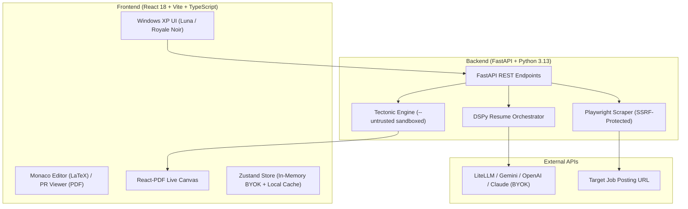

# Resume-Interview-Assistant (Enterprise Resume Rebuilder)

A privacy-focused, full-stack AI platform that analyzes, optimizes, and tailors resumes against target job descriptions with deterministic surgical patching, real-time sandboxed LaTeX compilation, dual-mode LaTeX/PDF workflows, and zero server-side data retention.

---

## Key Features

- **Universal Bring-Your-Own-Key (BYOK)**:
  - Vendor-agnostic model support powered by DSPy and LiteLLM.
  - Native presets for **Google Gemini**, **OpenAI**, **Anthropic Claude**, **Groq**, **xAI**, and **DeepSeek**.
  - All credentials remain strictly in-memory during your active session; never stored in databases, disk caches, or browser storage.

- **Dual-Mode Resume Input**:
  - **Interactive LaTeX Mode**: Upload or paste `.tex` source code, edit with full syntax highlighting via Monaco Editor, and stage AI suggestions.
  - **Direct PDF Mode**: Upload any standard `.pdf` resume. Plain text is extracted in-memory via `pypdf` and displayed with gutter line numbers for PR-style review and changelog advice.

- **Deterministic Surgical Patching**:
  - Eliminates fragile full-document hallucinations.
  - Generates verified, regex-normalized `{search_text, replace_with}` diff blocks applied in deterministic top-to-bottom order.
  - Staged review workflow: Review side-by-side diffs in the review modal or PR viewer before accepting.

- **Real-Time Sandboxed LaTeX Compilation**:
  - Instant compilation to PDF via the **Tectonic** engine in `--untrusted` sandboxed mode.
  - Built-in Local File Inclusion (LFI) and shell directive filters (blocks `\input`, `\include`, `\write18`, etc.).
  - Side-by-side live PDF preview canvas with zoom controls and one-click PDF download.

- **Multi-Turn AI Chat Assistant**:
  - Context-aware dialogue pane for targeted resume revisions and interview coaching.
  - Automatically converts conversational requests (e.g. *"Incorporate Docker and Terraform into my skills section"*) into staged surgical patches.

- **Retro Windows XP Interface**:
  - Authentic retro aesthetics with **XP Light (Luna)** and **XP Dark (Royale Noir / Zune)** themes.
  - Classic Tahoma typography, inset/outset beveled window chrome, and boxy retro scrollbars with zero-reload instant theme swapping.

- **Zero Server-Side Data Retention**:
  - In-memory request processing with no backend database.
  - Compilation runs inside self-deleting temporary directories (`tempfile.TemporaryDirectory()`).
  - LLM prompt and response disk caching disabled (`cache=False`).

---

## Tech Stack & Architecture



- **Frontend**:
  - Framework: React 18, Vite, TypeScript
  - Styling: Tailwind CSS, custom Windows XP theme system (`themes.css`)
  - State: Zustand with `idb-keyval` (IndexedDB persistence with memory-only credential exclusion)
  - Components: Monaco Editor (`@monaco-editor/react`), `react-pdf`, Lucide Icons
- **Backend**:
  - Framework: FastAPI, Uvicorn, Pydantic v2
  - AI Framework: DSPy (`dspy-ai`) configured for LiteLLM BYOK
  - PDF & Scraping: `pypdf`, Playwright (Chromium headless)
  - Compilation: Tectonic (Rust-based self-contained LaTeX engine)
- **Infrastructure**:
  - Docker & Docker Compose (Multi-stage builds, non-root execution)

---

## Quick Start (Docker)

The fastest way to run the entire stack locally:

1. Ensure [Docker](https://docs.docker.com/get-docker/) and [Docker Compose](https://docs.docker.com/compose/) are installed.
2. Clone the repository:
   ```bash
   git clone https://github.com/Jakevernice/Resume-Interview-Assistant.git
   cd Resume-Interview-Assistant
   ```
3. Launch the services:
   ```bash
   docker compose up --build
   ```
4. Open [http://localhost:3000](http://localhost:3000) in your browser.
5. Provide your LLM API key in the startup guard (e.g. Gemini, OpenAI, Claude) to begin.

---

## Local Development Setup

### Backend Prerequisites
- Python 3.10+ (Python 3.13 recommended)
- [Tectonic](https://tectonic-typesetting.github.io/en-US/) installed and available in `PATH`

```bash
cd backend
pip install -r requirements.txt
playwright install chromium
uvicorn backend.main:app --reload --port 8000
```

### Frontend Prerequisites
- Node.js 18+ and npm

```bash
cd frontend
npm install
npm run dev
```
The Vite development server will start on [http://localhost:5173](http://localhost:5173).

---

## Running Tests

### Backend Test Suite
```bash
pytest backend/tests/
```
Tests cover:
- SSRF and private IP blocking during URL scraping
- LaTeX file inclusion (LFI) and command injection sanitization
- Exception handling and API key scrub verification
- Deterministic regex normalization and patch application
- Multi-turn chat assistant and health check endpoints

### Frontend Test Suite
```bash
cd frontend
npm test
```
Tests cover response payload normalization, patch report coercion, and state management.

---

## Free Deployment Guide

This project is architected for **100% free hosting**:
- **Backend**: Deployable as a Docker Space on [Hugging Face Spaces](https://huggingface.co/spaces) (2 vCPUs, 16 GB RAM free tier).
- **Frontend**: Deployable as a static Vite SPA on [Vercel](https://vercel.com) or [Cloudflare Pages].

For step-by-step instructions, see [DEPLOY.md](DEPLOY.md).

---

## Security & Privacy Guidelines

- **Zero Logging of Credentials**: API keys supplied via `X-API-Key` or `X-Gemini-API-Key` headers are processed in-memory and explicitly excluded from server logs and error traces.
- **SSRF Protection**: Job description scraping strictly prohibits loopback, link-local, private RFC 1918 subnets, and cloud metadata endpoints (`169.254.169.254`).
- **LaTeX Sandboxing**: The compilation engine enforces `--untrusted` sandboxing and rejects any TeX directives that attempt directory traversal or shell escapes (`\write18`).
- **Session Reset**: The "Start New Session" action purges all resume text, extracted PDFs, and cached states from both memory and IndexedDB.

---

## License

This project is open-source and available under the [MIT License](LICENSE).
